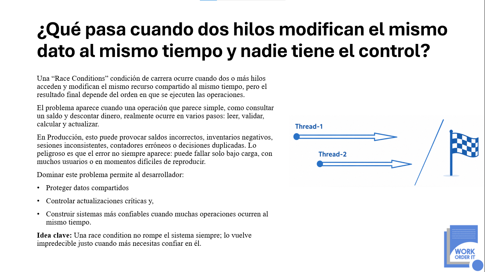

<p align="center">
  
</p>

# Python Concurrency Race Condition Lab

Laboratorio práctico en **Python 3.13** para entender uno de los problemas más importantes en sistemas concurrentes: las **Race Conditions** o condiciones de carrera.

El proyecto demuestra cómo un sistema puede intentar procesar muchas operaciones al mismo tiempo para ser más rápido, pero terminar generando resultados incorrectos cuando varios hilos modifican el mismo dato compartido sin coordinación.

## ¿Qué problema resuelve este proyecto?

En sistemas reales, muchas operaciones ocurren al mismo tiempo:

- Procesamiento de órdenes
- Transacciones financieras
- Actualización de inventarios
- Consumo de colas de mensajes
- Procesos batch
- APIs con múltiples usuarios
- Microservicios distribuidos

El riesgo aparece cuando varios hilos acceden y modifican el mismo recurso compartido sin control.

Este laboratorio muestra dos escenarios:

1. **Una implementación incorrecta**, donde varios hilos actualizan un resumen de ventas sin protección.
2. **Una implementación corregida**, donde se usa `threading.Lock` para proteger la sección crítica.

## Idea clave

La concurrencia no se trata solo de ejecutar más cosas al mismo tiempo.

Se trata de hacerlo con control.

Una mala implementación puede provocar:

- Datos inconsistentes
- Pérdida de actualizaciones
- Resultados impredecibles
- Errores difíciles de reproducir
- Fallos silenciosos en producción

Una buena implementación permite:

- Mayor rendimiento
- Mejor uso de recursos
- Resultados confiables
- Código más seguro para ambientes concurrentes

## Requisitos

- Python 3.13 o superior

Verificar versión instalada:

```bash
python --version

---

## Autor

**Work Order IT**  
Soluciones tecnológicas, arquitectura de software y formación técnica para equipos de desarrollo.

Este repositorio forma parte de una iniciativa educativa orientada a explicar cómo la concurrencia en **Python 3.13** puede acelerar un sistema o volverlo impredecible cuando el estado compartido no se controla correctamente.

Website: [www.workorder-it.net](https://www.workorder-it.net)
